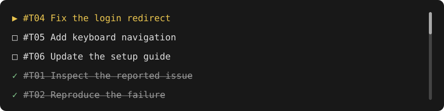

# Codex Tasklist

A live task list below Codex CLI in **WezTerm**. Python 3.10+, no extra packages.



*Illustrative preview with sample tasks.* Active → pending → done. IDs stay fixed; each Codex session has its own saved queue.

## Install

Requires **Codex CLI**, **WezTerm**, and **Python 3.10+** (`python3` on Linux/macOS; `python` on Windows PATH).

```sh
codex plugin marketplace add martinille/codex-tasklist
codex plugin add codex-tasklist@codex-tasklist
```

Review and trust the plugin hooks in `/hooks`, then start a new Codex session in WezTerm. The repository is currently private, so GitHub access is required.

**Outside WezTerm:** queue commands work in Bash and PowerShell, but the automatic panel does not.

## Controls

| Action | Control |
| --- | --- |
| Scroll | Mouse wheel, ↑ / ↓, Page Up / Down |
| Jump | Home / End or click the scrollbar |
| Resize temporarily | Drag the pane divider |
| Save a height | Ask Codex; 1–40 rows, default 5 |
| Close panel | `q`; the next prompt reopens it |

<details>
<summary><strong>Platform checks &amp; known limitations</strong></summary>

| Environment | Verified |
| --- | --- |
| Linux | Five tests, including live panel scrolling, resizing and updates |
| Windows + WezTerm | Four tests; real Codex session opened the panel and created/completed a task; keyboard scrolling and styling checked |
| Bash / PowerShell without WezTerm | Queue commands and hook output only |
| macOS | Not yet tested on a real machine |

- Panels require a live Codex CLI owner and close when it exits, including abrupt termination, or when the session moves to another owner or pane. Linux process tests cover these paths and preserve saved tasks; real Codex exit/resume integration still needs checking.
- Ownership is detected through the nearest Codex CLI ancestor of its hook. Desktop app-server sessions are outside this support contract. Windows process lookup was checked in a VM; full lifetime tests on Windows and macOS remain outstanding.
- Concurrent panel creation is serialized per session without blocking queue writes during terminal calls. A dead creator's reservation is reclaimed on retry; an unregistered panel closes on its next ownership check after its renderer starts. A different live Codex owner must close before that session can be resumed elsewhere.
- Windows mouse scrolling and runtime pane resizing still need verification.
- The Windows VirtualBox test had low contrast and WezTerm graphics warnings; these remain unresolved.
- Packaging checked with Codex 0.153.4; Windows integration with 0.146.0.

</details>

<details>
<summary><strong>Development &amp; storage</strong></summary>

Install from a local checkout:

```sh
codex plugin marketplace add .
codex plugin add codex-tasklist@codex-tasklist
```

Run tests:

```sh
python3 -m unittest discover -s tests
```

Manual queue example from the repository root:

```sh
python3 plugins/codex-tasklist/scripts/tasklist.py --session demo add "Inspect the issue" --status active
python3 plugins/codex-tasklist/scripts/tasklist.py --session demo update 1 --status done
python3 plugins/codex-tasklist/scripts/tasklist.py --session demo list
```

Use numeric IDs (`1`, not `T01`). On Windows, use `python` instead of `python3`.

Installed queues use `PLUGIN_DATA`; manual commands default to `$XDG_STATE_HOME/codex-tasklist` or `~/.local/state/codex-tasklist`. Use the hook's `--data-dir` to inspect an installed queue. SQLite protects concurrent updates; task titles reject terminal controls. The plugin does not upload queue data to GitHub.

Source: `plugins/codex-tasklist/`. Marketplace: `.agents/plugins/marketplace.json`. Reinstall after source changes and restart Codex to load updated hooks.

</details>

## License

[MIT](LICENSE).
